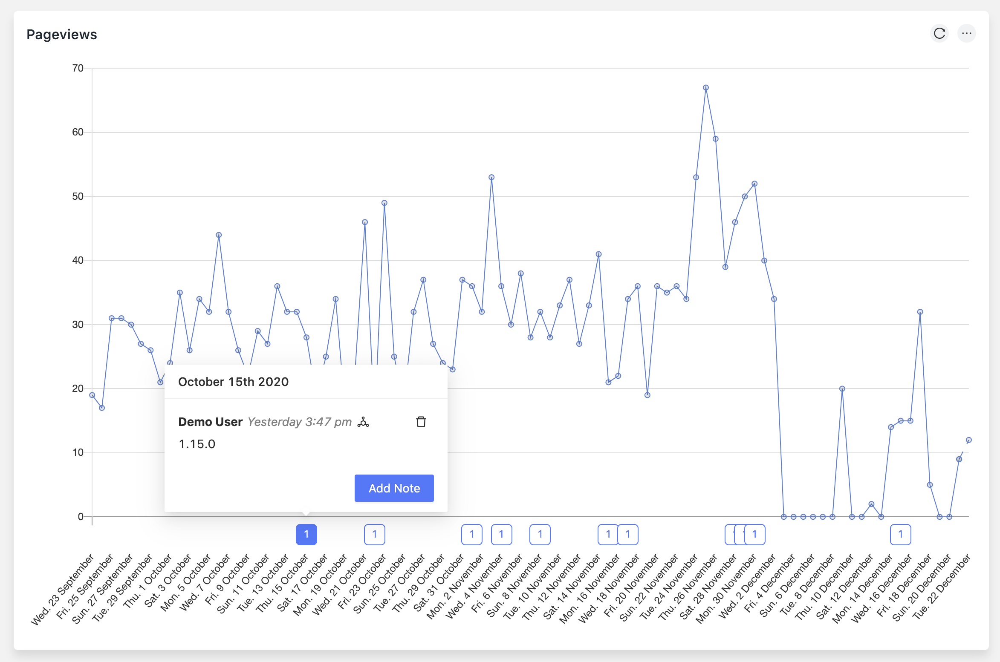

# Github Release Tracking Plugin

Integrate PostHog with GitHub and get automatic graph annotations based on your repository's tags so you can analyze the impact of new releases on your key metrics.

## Questions?

### [Join our Slack community.](https://join.slack.com/t/posthogusers/shared_invite/enQtOTY0MzU5NjAwMDY3LTc2MWQ0OTZlNjhkODk3ZDI3NDVjMDE1YjgxY2I4ZjI4MzJhZmVmNjJkN2NmMGJmMzc2N2U3Yjc3ZjI5NGFlZDQ)
